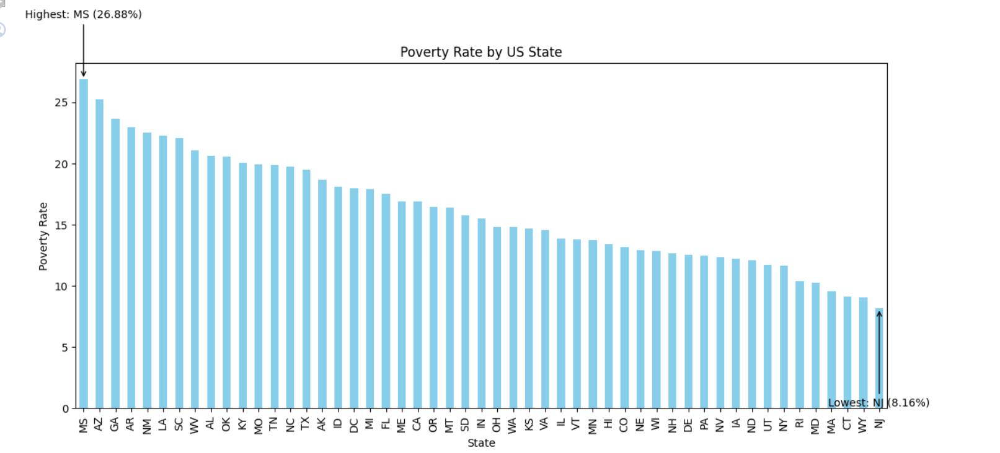
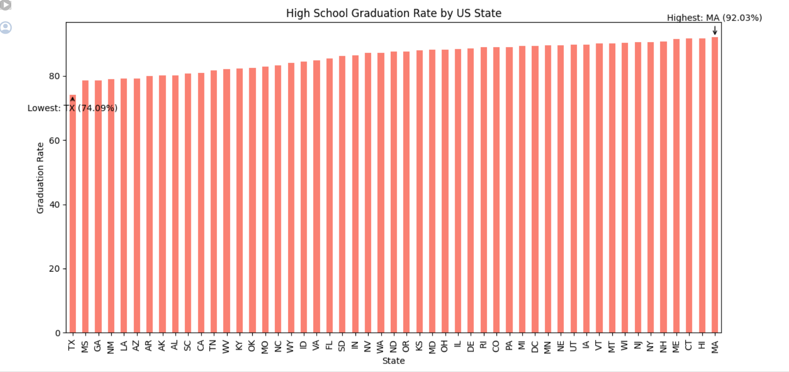
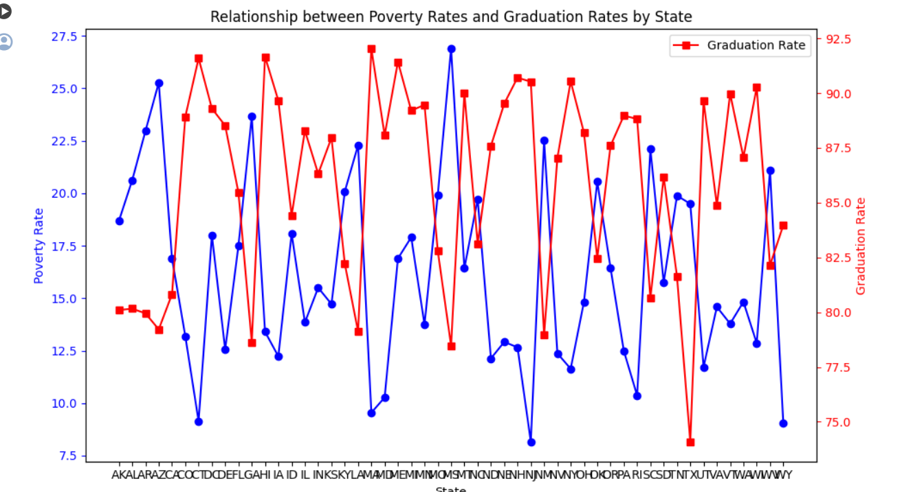
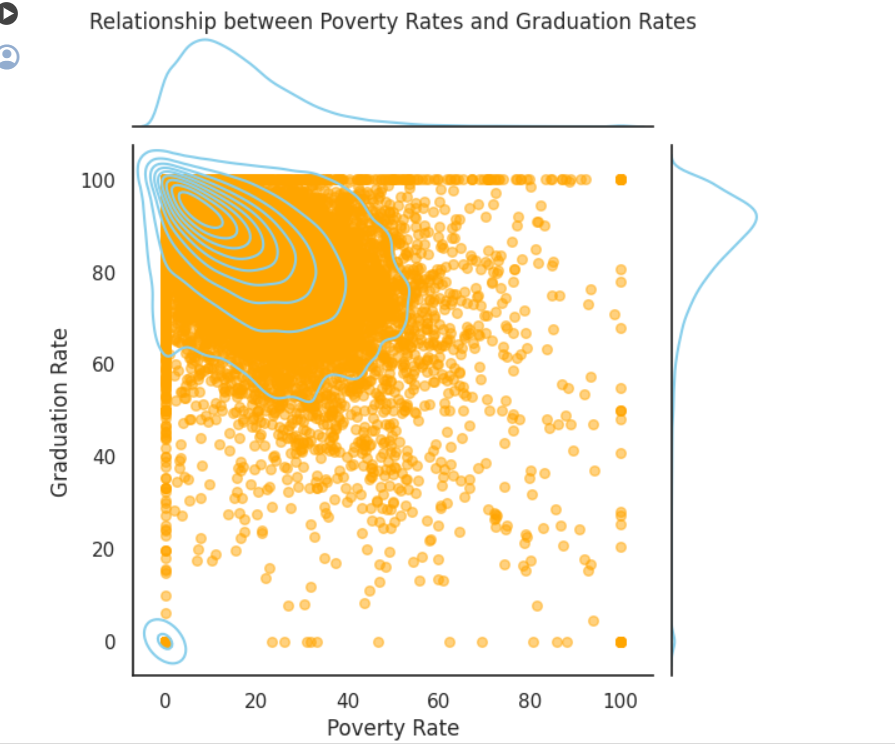
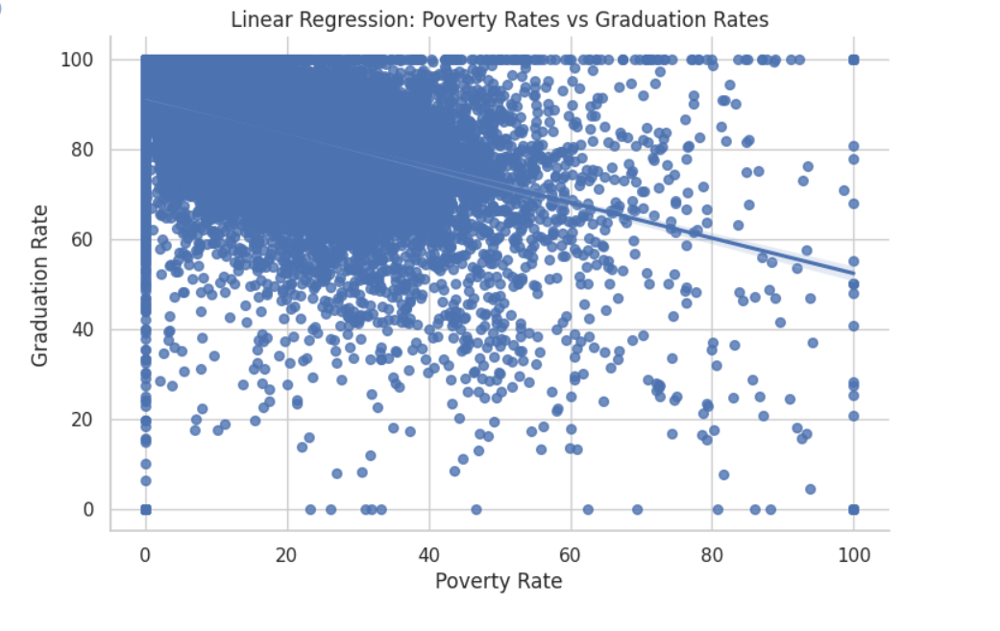
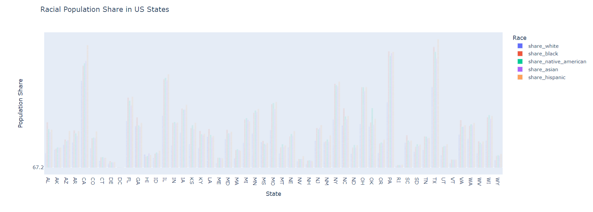
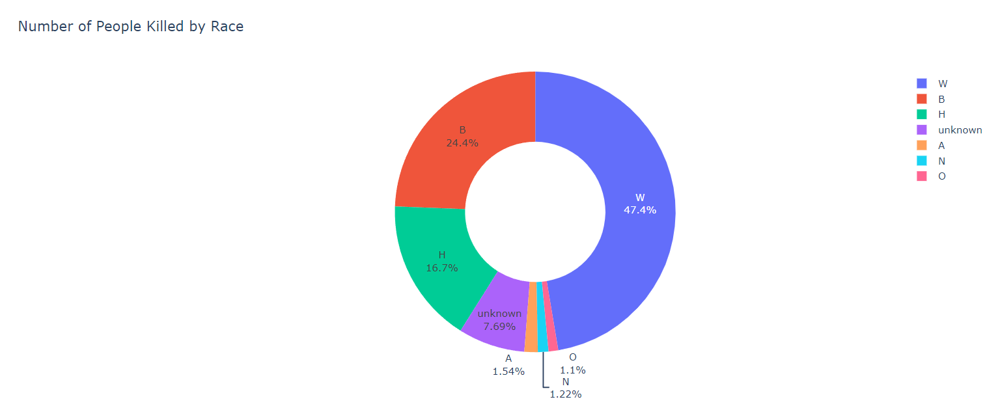
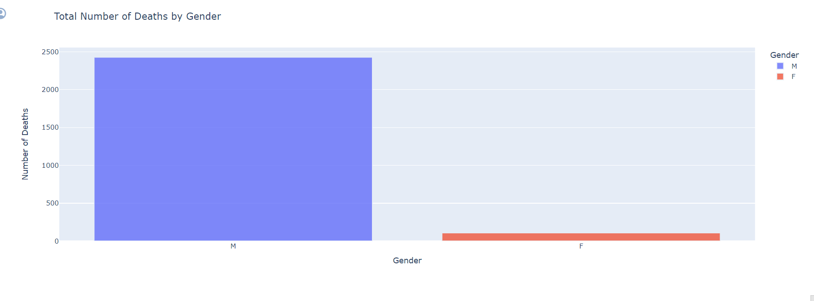

# Fatal Force Analysis

This repository created with Google Colab to extract insights from combining US census data and the Washington Post's database on deaths by police in the United States. This help to get better understand social trends and what is going on with the fatal use of force by the police in the United States.

## Technology Used
- NumPy
- Pandas
- Plotly Express
- Matplotlib
- Seaborn
- iso3166 


## Getting Started
To run the code and reproduce the analysis, follow these steps:
- Install the iso3166 package:

    ``` %pip install --upgrade plotly ```
- Upgrade Plotly (if using Google Colab):

  ``` %pip install --upgrade plotly ```

- Import the necessary libraries:

  ```
  import numpy as np
  import pandas as pd
  import plotly.express as px
  import matplotlib.pyplot as plt
  import seaborn as sns
   ```

- Load the data:

  ```
  df_hh_income = pd.read_csv('Median_Household_Income_2015.csv', encoding="windows-1252")
  df_pct_poverty = pd.read_csv('Pct_People_Below_Poverty_Level.csv', encoding="windows-1252")
  df_pct_completed_hs = pd.read_csv('Pct_Over_25_Completed_High_School.csv', encoding="windows-1252")
  df_share_race_city = pd.read_csv('Share_of_Race_By_City.csv', encoding="windows-1252")
  df_fatalities = pd.read_csv('Deaths_by_Police_US.csv', encoding="windows-1252")
   ```

  ## Screenshots
     - **Poverty Rate in each US State:**
        <div align="center"></div>
     
     - **High School Graduation Rate by US State:**
       <div align="center"></div>

     - **The Relationship between Poverty Rates and High School Graduation Rates:**
      <div align="center"></div>

    - **The Relationship between Poverty Rates and High School Graduation Rates:** Seaborn .jointplot() with a Kernel Density Estimate (KDE) and/or scatter plot 
      <div align="center"></div>
 
   - **The poverty ratio and the high school graduation ratio:**
     <div align="center"></div>

   - **Subsections Showing the Racial Makeup of Each US State:**
     <div align="center"></div> 

  - **Donut Chart by of People Killed by Race:**
     <div align="center"></div> 

  - **Comparing the Total Number of Deaths of Men and Women:**
     <div align="center"></div>
